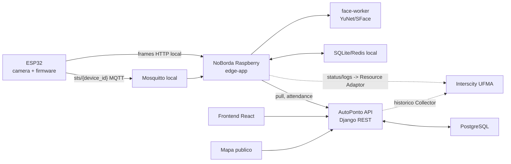
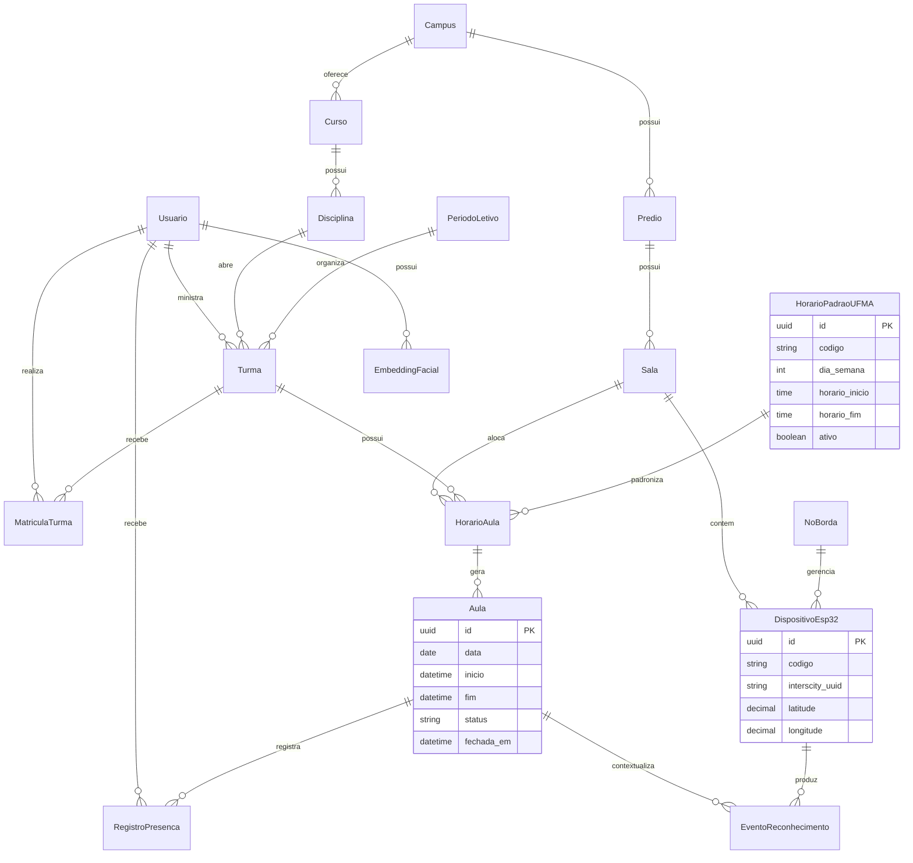
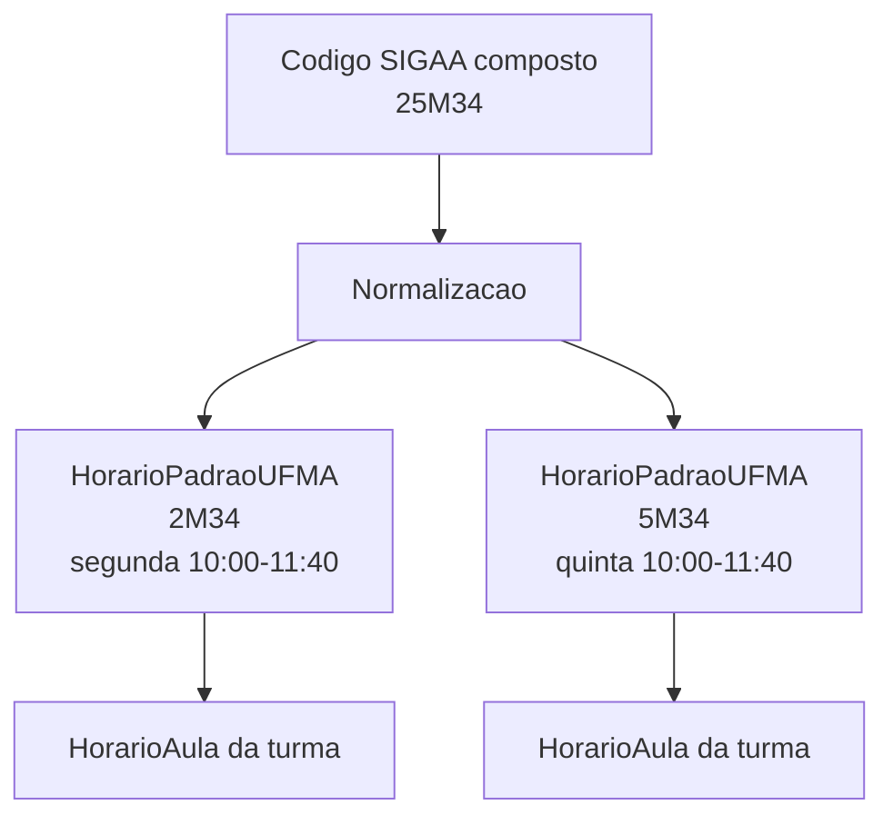
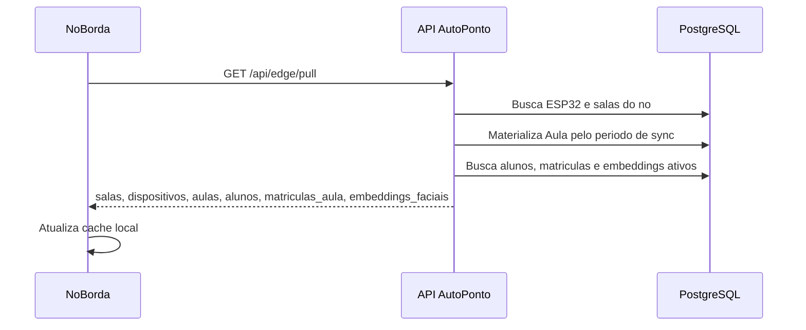
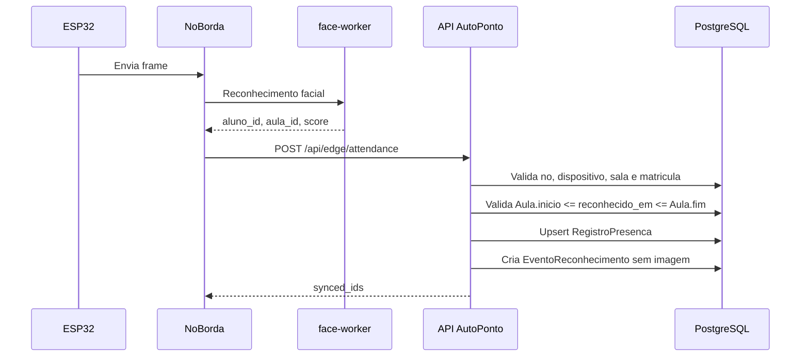
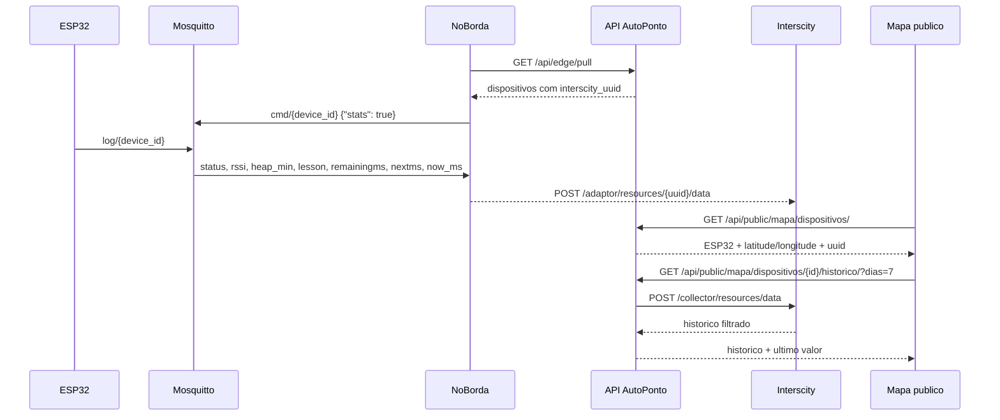
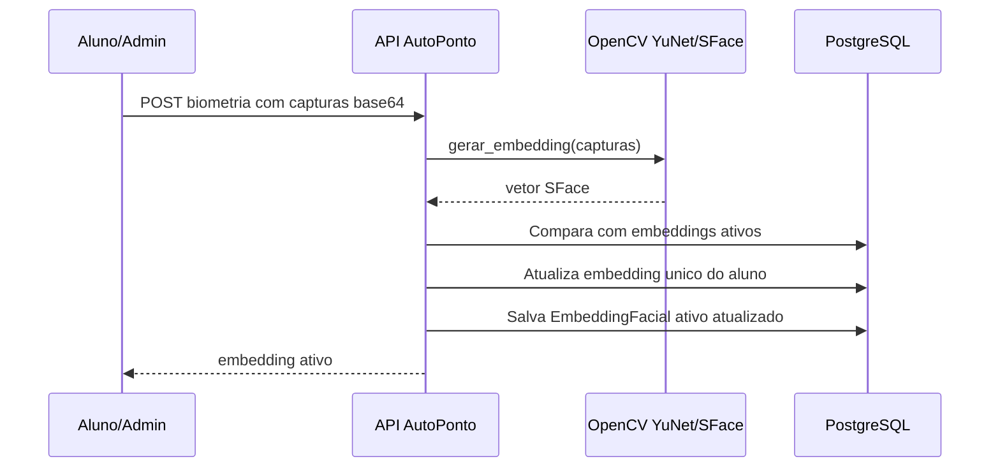
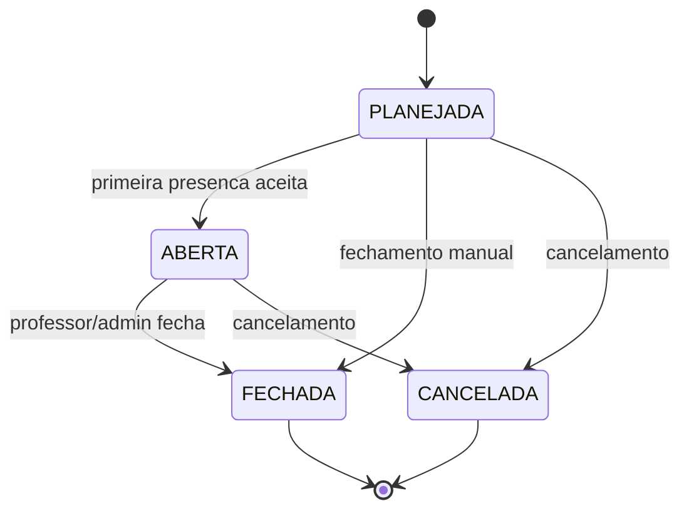
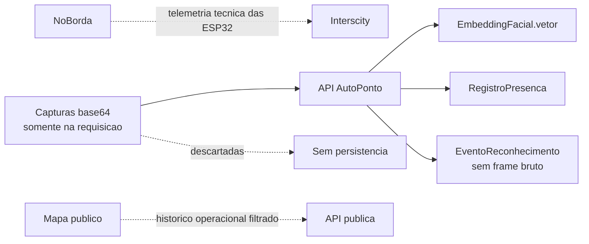

# Diagramas Uteis Para O TCC

Diagramas em Mermaid para explicar o MVP AutoPonto.

## 1. Arquitetura Geral

## 2. Entidade E Relacionamento Principal

## 3. Codigo UFMA Para Horarios

## 4. Fluxo De Pull

## 5. Fluxo De Presenca

## 6. Interscity E Mapa Publico

## 7. Fechamento Manual

## 8. Biometria

## 9. Estados Da Aula

## 10. Privacidade

## Sugestao De Uso

- Arquitetura: diagrama 1.
- Banco/modelagem: diagramas 2 e 3.
- Operacao normal: diagramas 4 e 5.
- IoT/Interscity e mapa publico: diagrama 6.
- Fechamento manual: diagrama 7.
- Biometria, estados e privacidade: diagramas 8 a 10.
