# Diagramas Uteis Para O TCC

Diagramas em Mermaid para explicar o MVP AutoPonto. Eles usam os nomes atuais do codigo em portugues.

## 1. Visao Geral Da Arquitetura

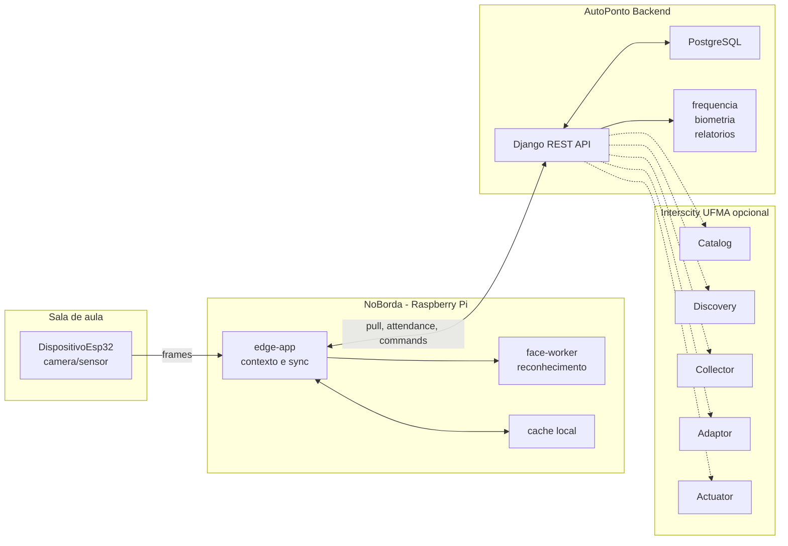

## 2. Entidade E Relacionamento Principal

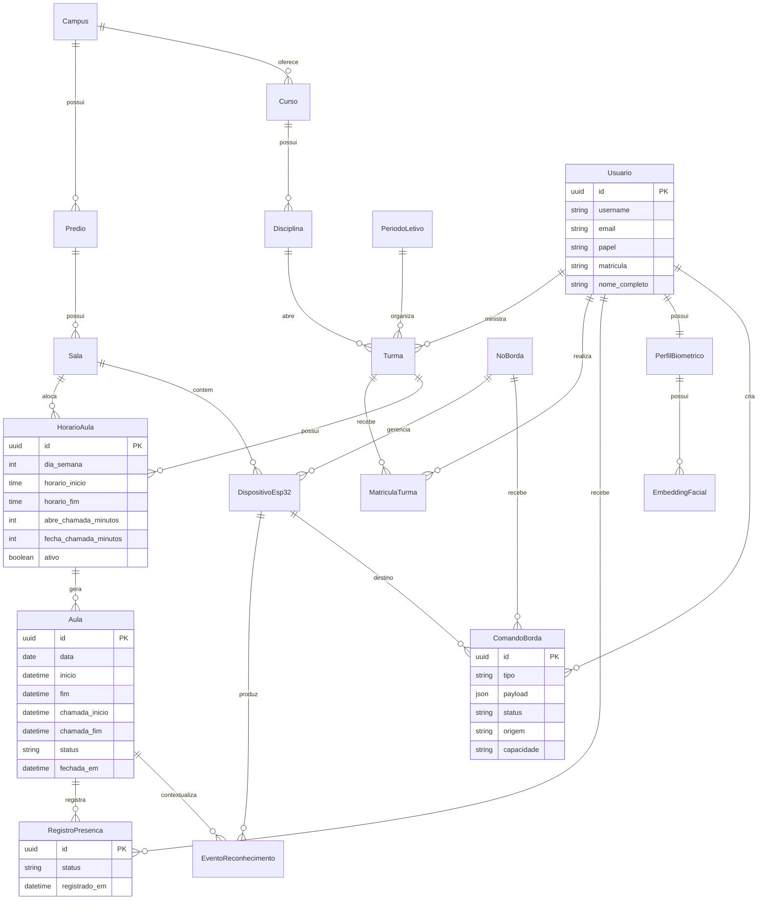

## 3. Modelo Academico Enxuto

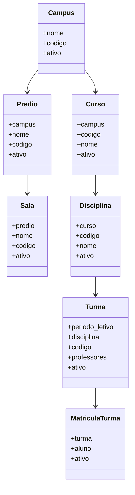

## 4. Janela De Chamada

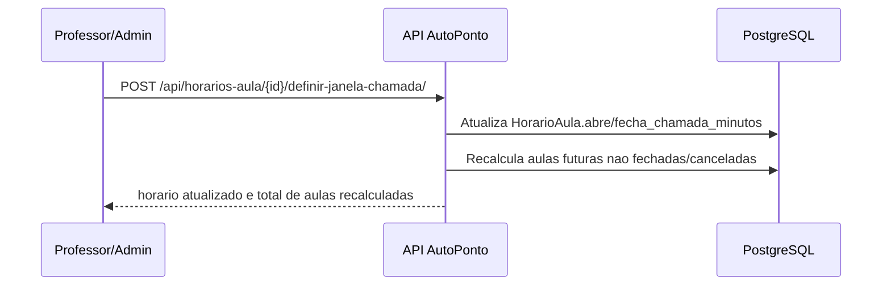

## 5. Fechamento Manual Da Chamada

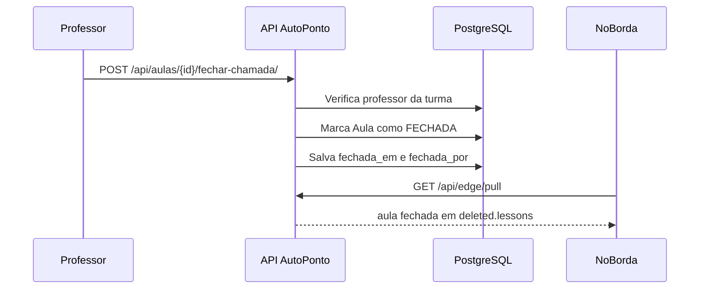

## 6. Fluxo De Sincronizacao Do No

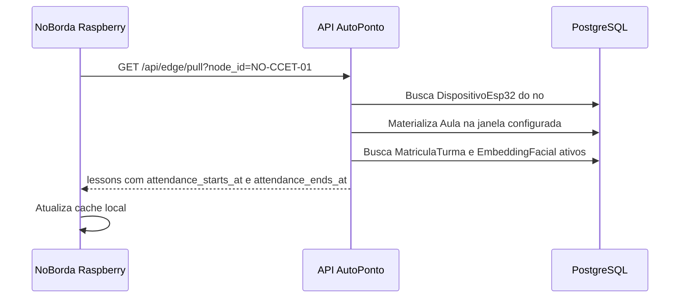

## 7. Fluxo De Registro De Presenca

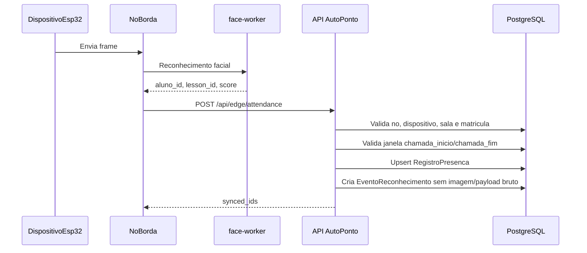

## 8. Fluxo De Biometria

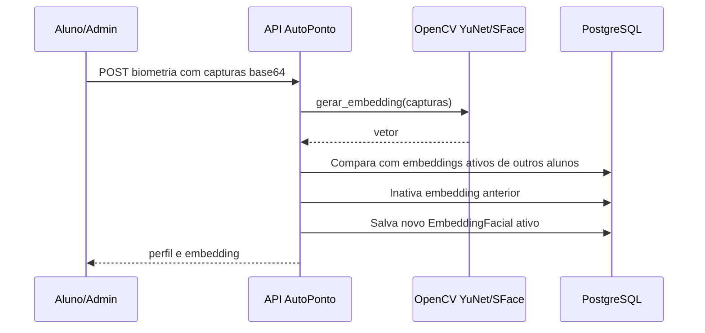

## 9. Fluxo De Comando

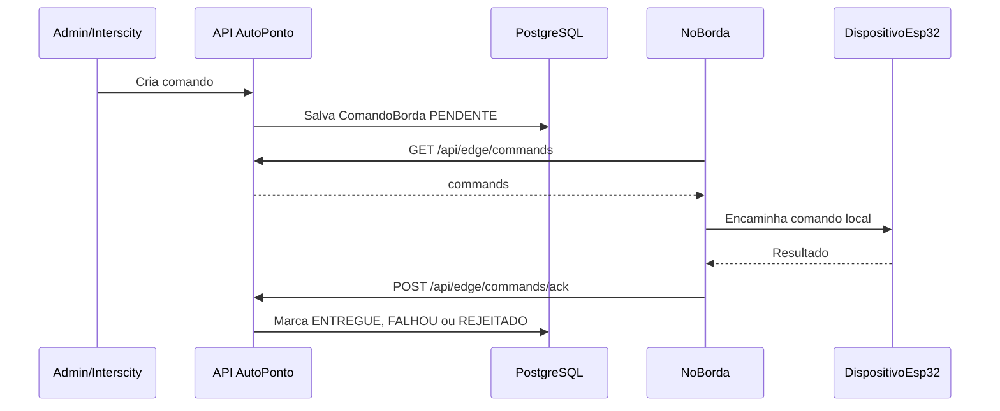

## 10. Estados

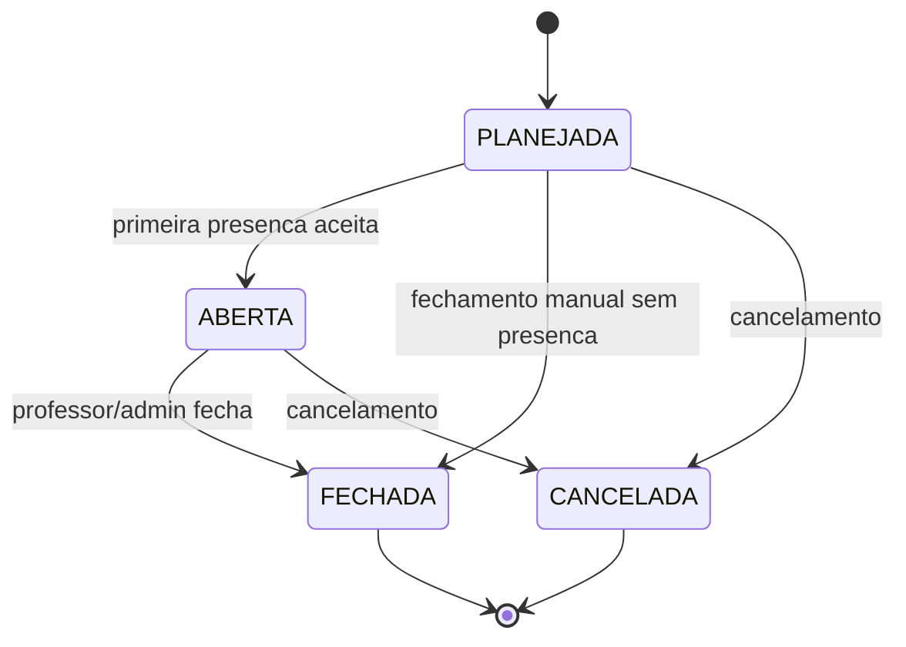

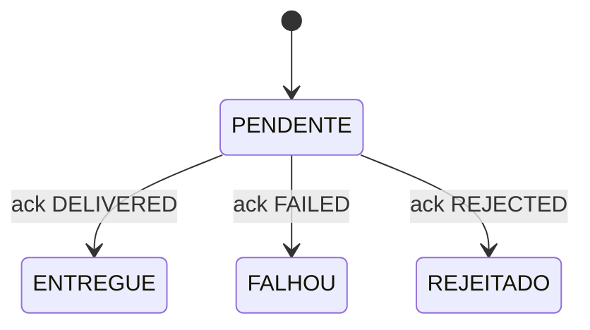

## 11. Privacidade

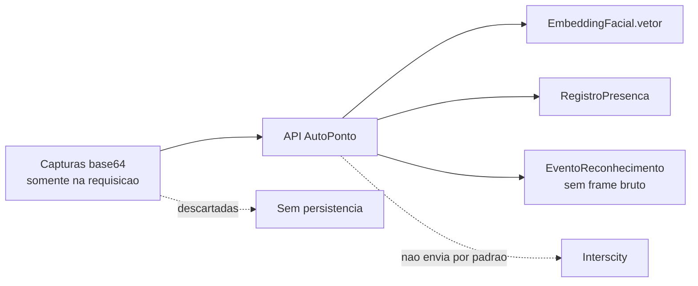

## Sugestao De Uso No Texto

- Arquitetura: diagrama 1.
- Banco/modelagem: diagramas 2 e 3.
- Janela e fechamento de chamada: diagramas 4 e 5.
- Operacao normal do sistema: diagramas 6 e 7.
- Biometria e privacidade: diagramas 8 e 11.
- Comandos e Interscity: diagrama 9.
