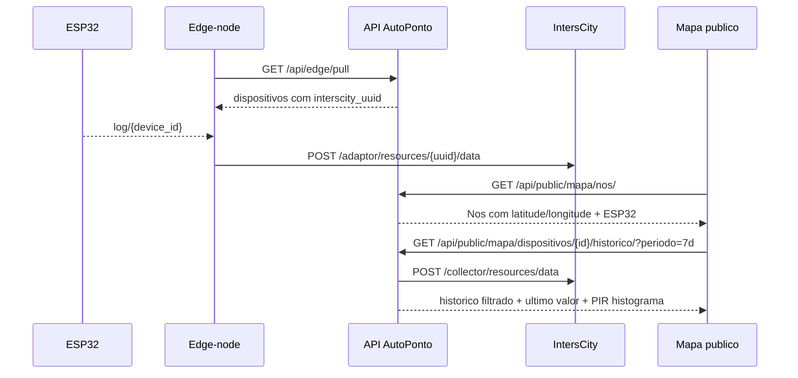

# Integracao AutoPonto E IntersCity

## Papel Atual No MVP

O AutoPonto continua canonico para usuarios, turmas, aulas, biometria, presencas e relatorios. O IntersCity fica restrito a observabilidade IoT das ESP32.

Nao existem recursos IntersCity para `NoBorda`. Cada recurso IntersCity representa uma ESP32 cadastrada em `DispositivoEsp32.interscity_uuid`.

## Fluxo Operacional

1. A API principal envia ao edge, em `GET /api/edge/pull`, cada ESP32 com `codigo`, `sala_id` e `interscity_uuid`.
2. O edge-node usa esse UUID para publicar diretamente no Resource Adaptor.
3. O Data Collector armazena historico das capacidades tecnicas.
4. A API principal oferece endpoints publicos de mapa para listar nos/ESP32 cadastrados e consultar historico do Collector sob demanda.



## Capacidades Do Mapa

O proxy publico da API filtra apenas capacidades operacionais:

- `status`
- `presenca`
- `rssi`
- `heap_free`
- `heap_min`
- `heap_max`
- `psram_free`
- `psram_min`
- `psram_max`
- `lesson`
- `remaining_ms`
- `next_ms`
- `now_ms`
- `post_max_ms`

Dados biometricos, imagens, embeddings, nomes de alunos e presencas individuais nao entram no IntersCity.

## Publicacao Pelo Edge

Payload esperado ao Resource Adaptor:

```json
{
  "data": {
    "status": [
      {
        "value": "idle"
      }
    ],
    "presenca": [
      {
        "value": true
      }
    ],
    "rssi": [
      {
        "value": -61
      }
    ],
    "heap_free": [
      {
        "value": 130000
      }
    ],
    "heap_min": [
      {
        "value": 120000
      }
    ],
    "heap_max": [
      {
        "value": 150000
      }
    ],
    "psram_free": [
      {
        "value": 3500000
      }
    ],
    "psram_min": [
      {
        "value": 3200000
      }
    ],
    "psram_max": [
      {
        "value": 3800000
      }
    ],
    "lesson": [
      {
        "value": "Desenvolvimento de Sistemas Web - A"
      }
    ],
    "remaining_ms": [
      {
        "value": 500000
      }
    ],
    "next_ms": [
      {
        "value": 1200000
      }
    ],
    "now_ms": [
      {
        "value": 12345678
      }
    ],
    "post_max_ms": [
      {
        "value": 240
      }
    ]
  }
}
```

O nome exato do envelope pode variar conforme o Resource Adaptor usado, mas o Data Collector deve expor essas capacidades em `/collector/resources/data`.

## Endpoints Da API Principal

- `GET /api/public/mapa/nos/`: lista nos de borda ativos com latitude/longitude e ESP32 ativas.
- `GET /api/interscity/diagnostico/`: diagnostico administrativo do Collector configurado.
- `GET /api/public/mapa/dispositivos/`: rota compativel que retorna o mesmo agrupamento por no.
- `GET /api/public/mapa/dispositivos/{id}/historico/?periodo=7d`: consulta o Data Collector via proxy tolerante a falhas.

O endpoint de historico chama:

```http
POST {INTERSCITY_BASE_URL}{INTERSCITY_COLLECTOR_PATH}/resources/data
```

Com corpo:

```json
{
  "uuids": ["uuid-da-esp32"],
  "capabilities": [
    "status",
    "presenca",
    "rssi",
    "heap_free",
    "heap_min",
    "heap_max",
    "psram_free",
    "psram_min",
    "psram_max",
    "lesson",
    "remaining_ms",
    "next_ms",
    "now_ms",
    "post_max_ms"
  ],
  "start_date": "2026-06-12T12:00:00Z",
  "end_date": "2026-06-19T12:00:00Z"
}
```

## Variaveis

```env
INTERSCITY_BASE_URL=https://cidadesinteligentes.lsdi.ufma.br/interscity_lh
INTERSCITY_COLLECTOR_PATH=/collector
INTERSCITY_TIMEOUT_SECONDS=5
```

Falhas externas nao bloqueiam login, CRUD, biometria, presencas, relatorios ou sync edge.
