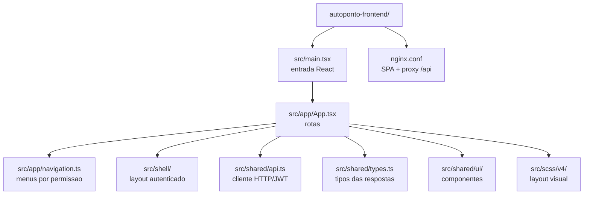
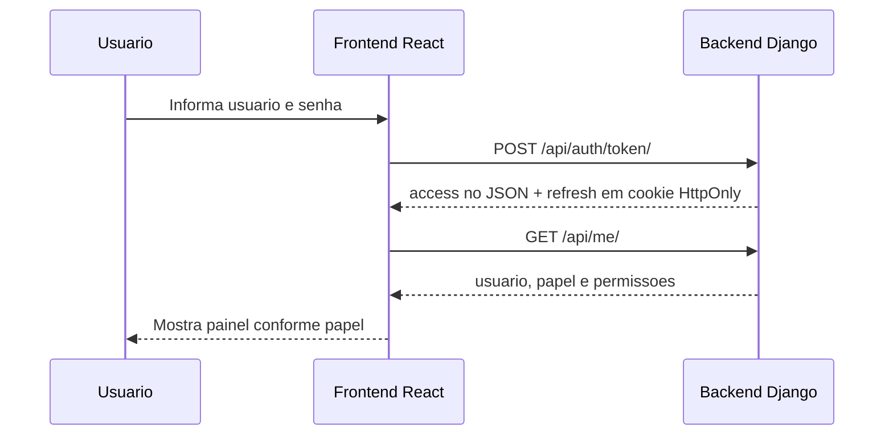
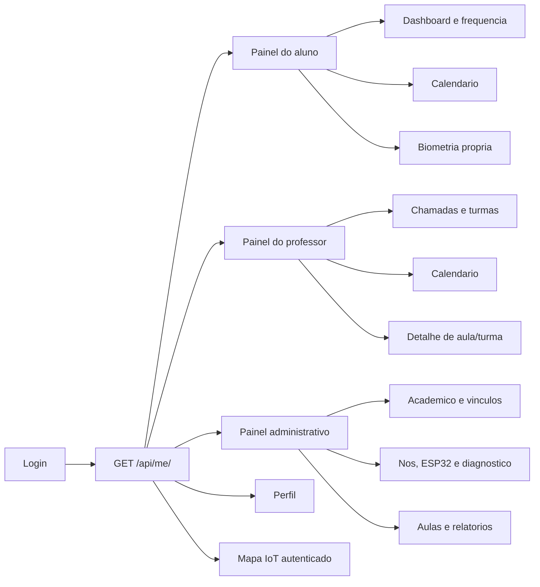
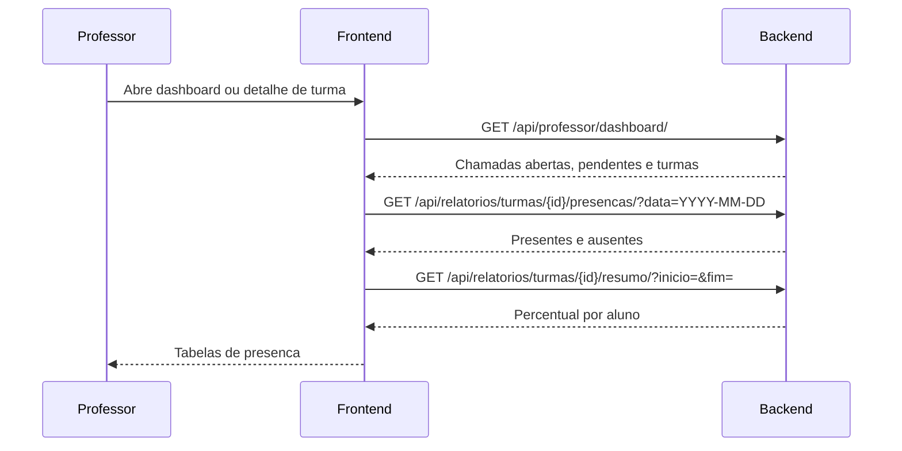
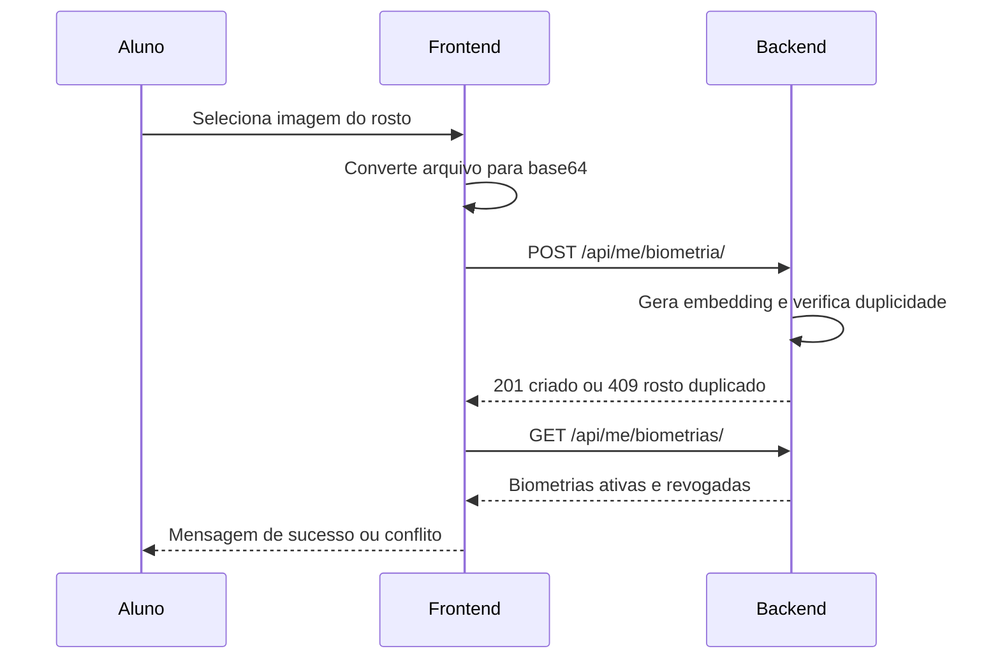
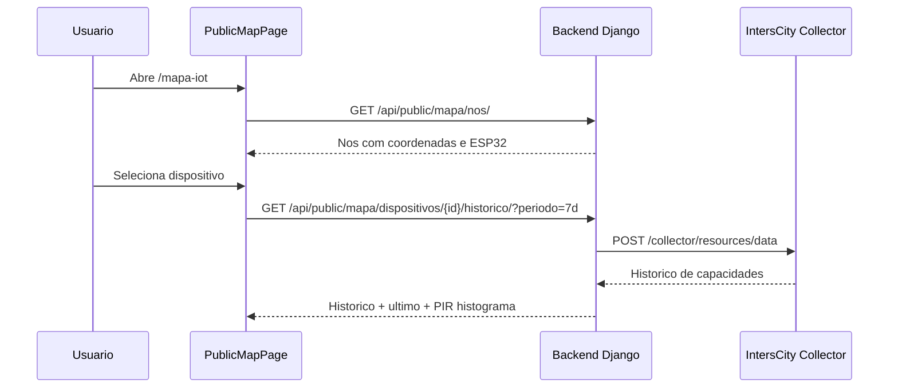
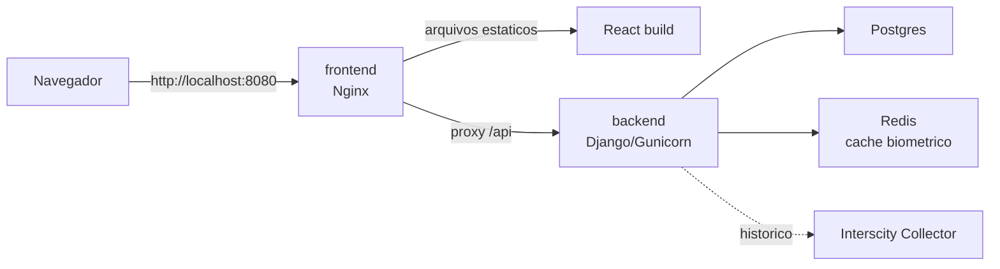

# Diagramas Uteis Do Frontend

Estes diagramas ajudam a explicar o painel web do AutoPonto no TCC.

## 1. Organizacao Do Codigo

## 2. Fluxo De Login

## 3. Navegacao Por Papel

## 4. Fluxo De Relatorio Do Professor

## 5. Cadastro Biometrico Pelo Aluno

## 6. Mapa IoT Publico

## 7. Deploy Com Docker Compose

## Sugestao De Uso No Texto

- Use o diagrama 1 para explicar onde ficam os arquivos do frontend.
- Use os diagramas 2 e 3 para explicar autenticacao e autorizacao por papel.
- Use o diagrama 4 para justificar dashboard, detalhe de turma e relatorios do professor.
- Use o diagrama 5 para explicar a experiencia do cadastro biometrico.
- Use o diagrama 6 para explicar mapa publico e historico IoT.
- Use o diagrama 7 para apresentar o deploy integrado.
