# Diagramas Uteis Para O TCC

Este documento reune diagramas em Mermaid para explicar o AutoPonto no TCC. Eles foram escritos com os nomes atuais do codigo em portugues e podem ser renderizados no GitHub, VS Code ou em editores Mermaid.

## 1. Visao Geral Da Arquitetura

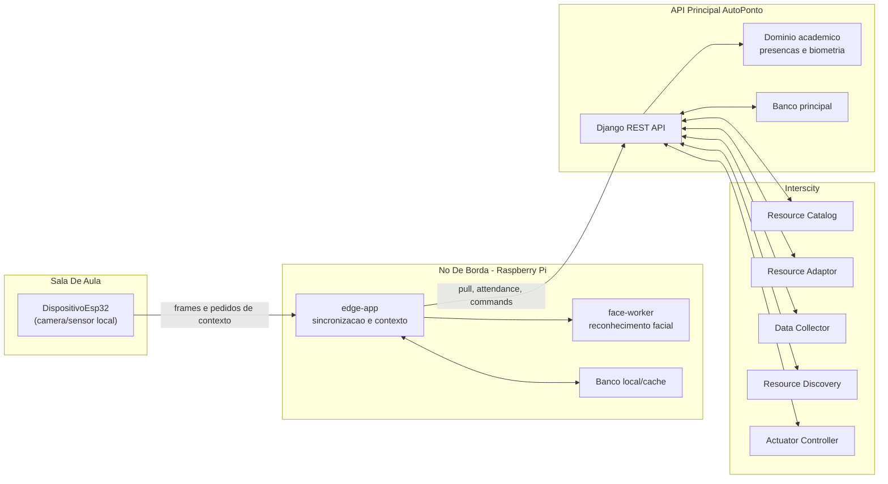

## 2. Topologia IoT

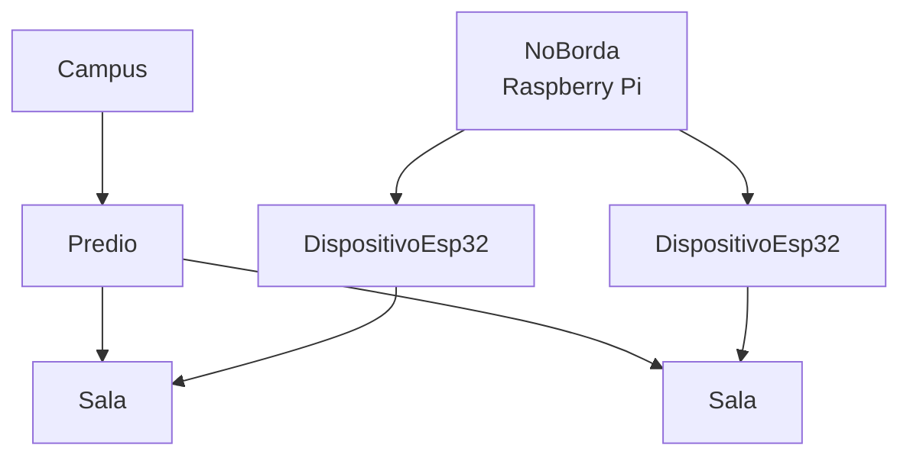

## 3. Entidade E Relacionamento Principal

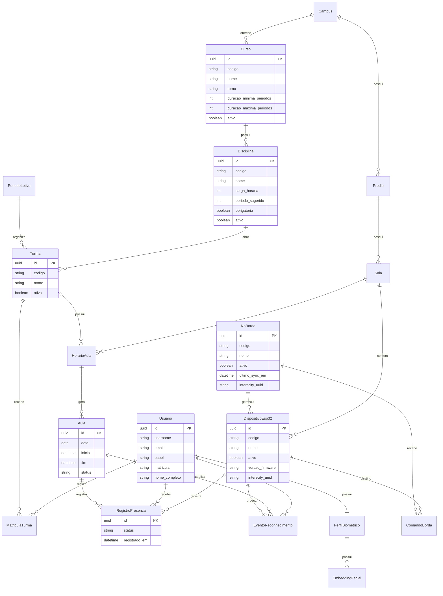

## 4. Modelo Academico Simplificado

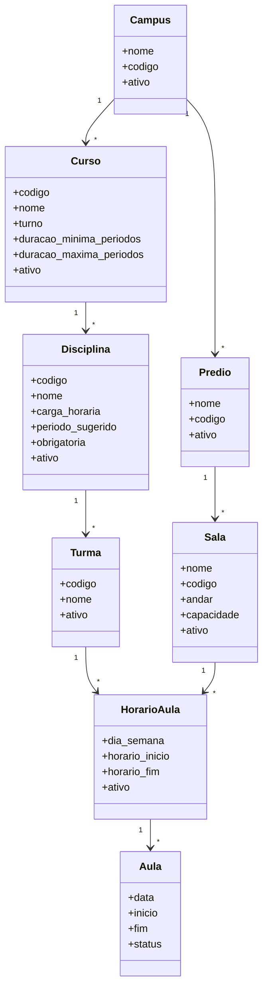

## 5. Fluxo De Sincronizacao Do No

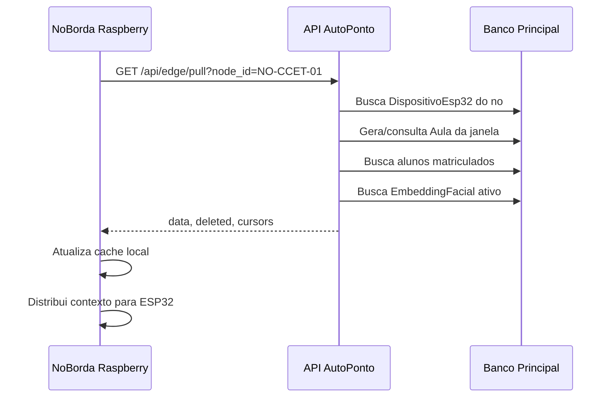

## 6. Fluxo De Registro De Presenca

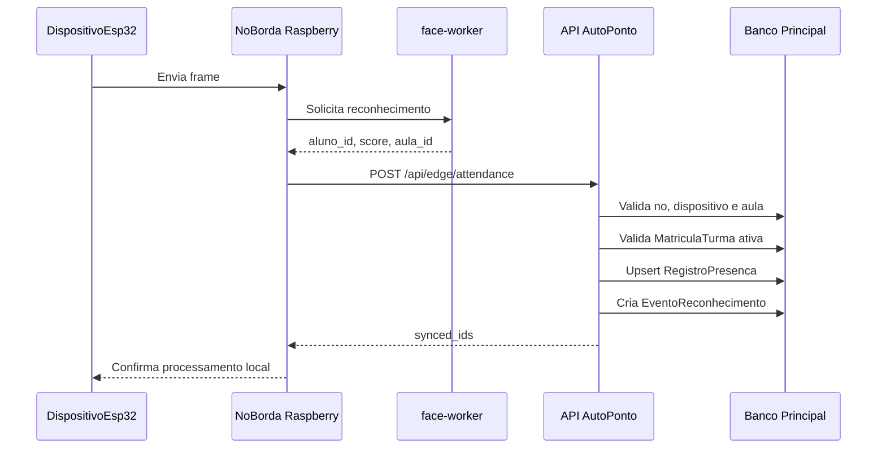

## 7. Fluxo De Matricula Biometrica

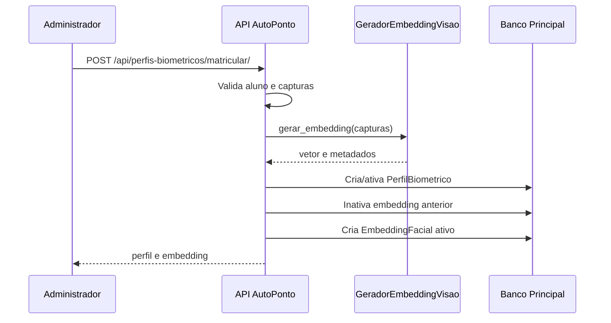

## 8. Fluxo De Comando Via Interscity

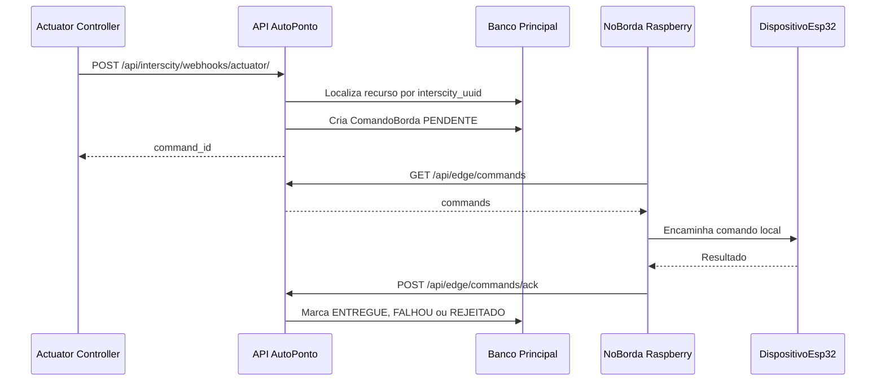

## 9. Estados Da Aula

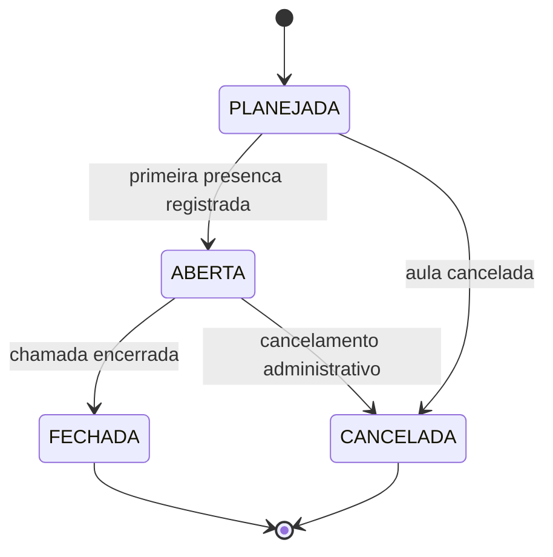

## 10. Estados Do Comando De Borda

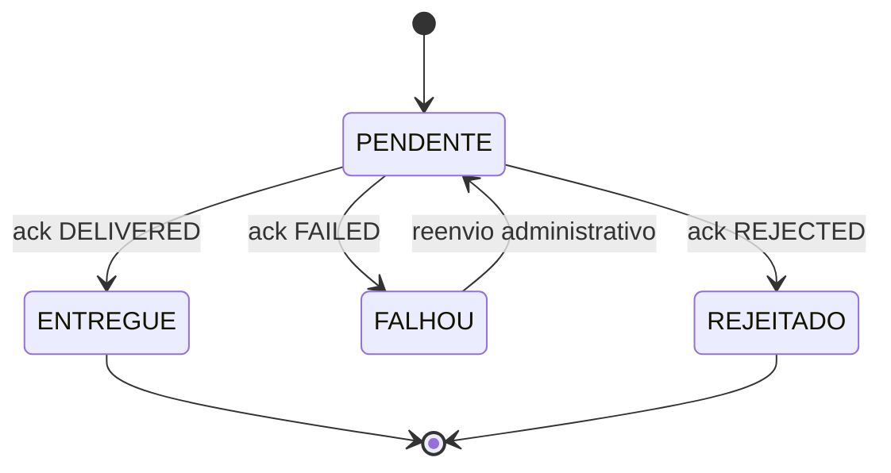

## 11. Privacidade E Fronteiras De Dados

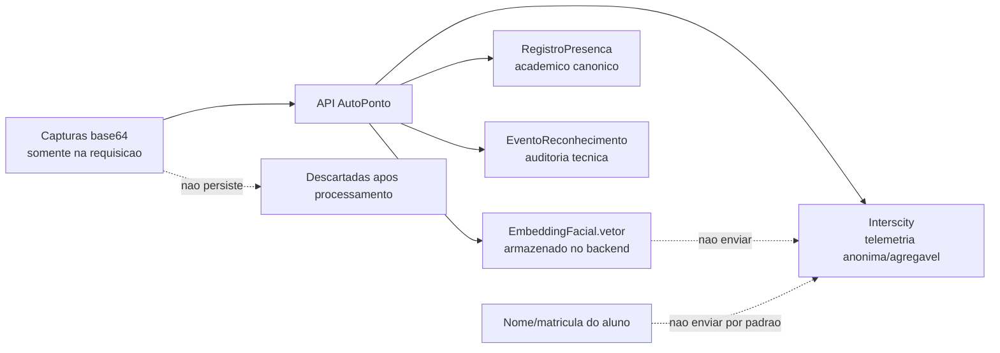

## 12. Organizacao Do Codigo

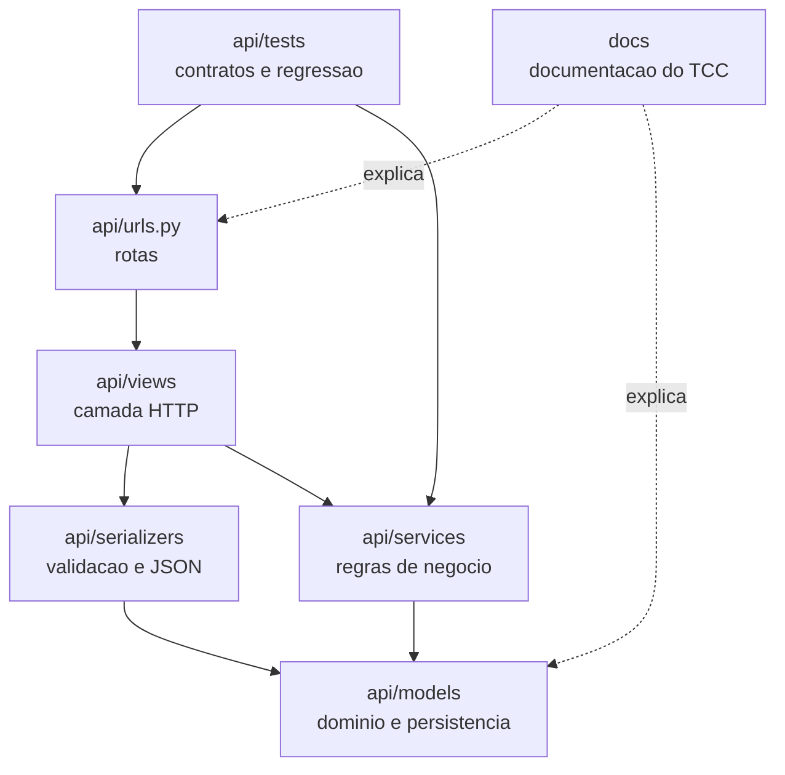

## Sugestao De Uso No Texto

- Use o diagrama 1 para apresentar a arquitetura geral.
- Use o diagrama 3 para explicar a modelagem do banco.
- Use os diagramas 5 e 6 para explicar a operacao normal do sistema.
- Use o diagrama 7 para explicar biometria e privacidade.
- Use o diagrama 8 para justificar a integracao com Interscity.
- Use os diagramas 9 e 10 se precisar explicar estados e robustez operacional.
