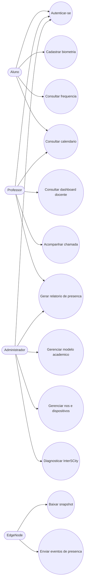
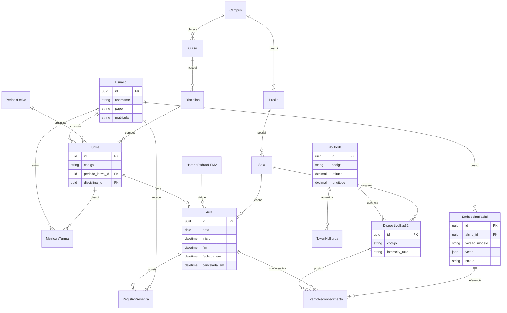
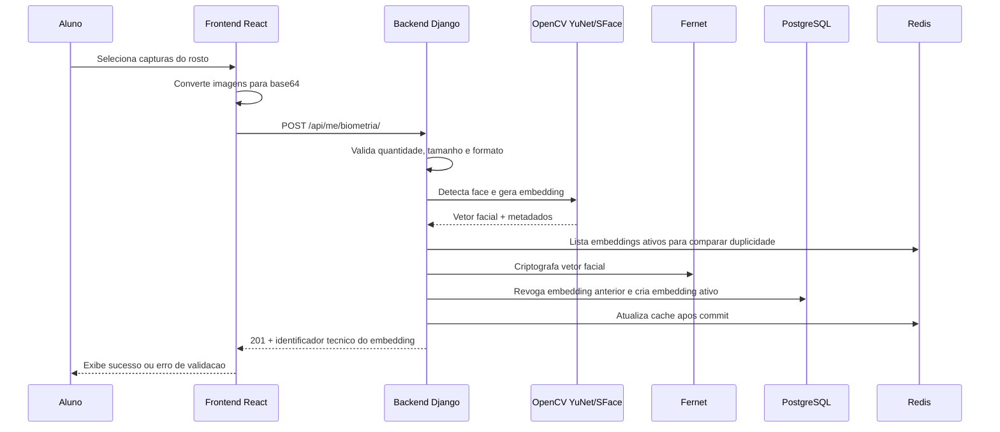
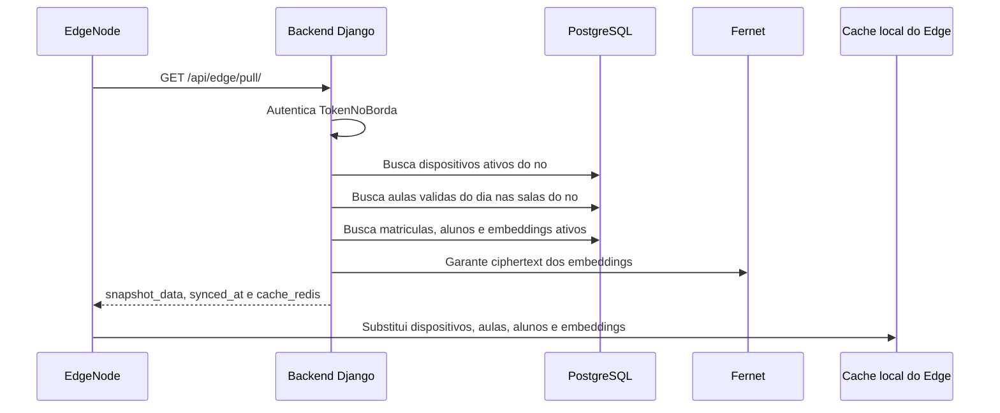
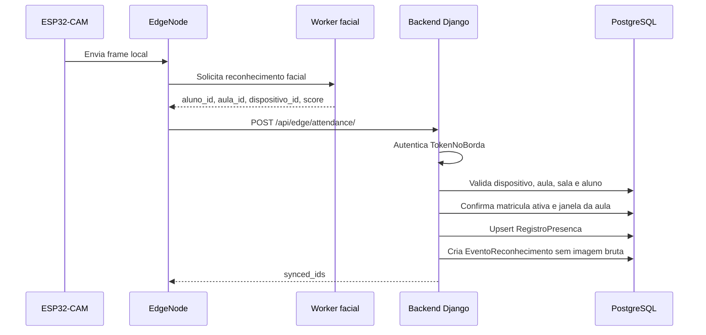
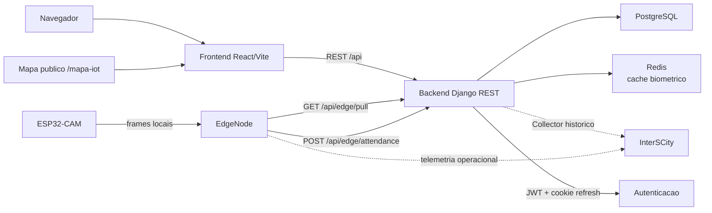
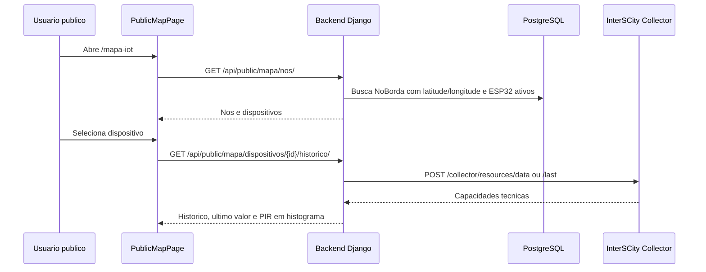
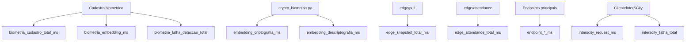
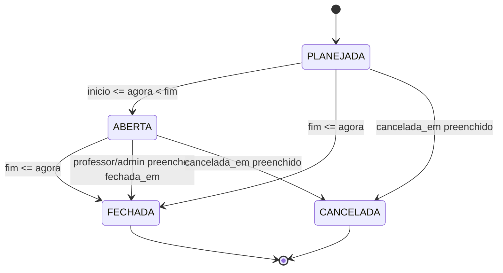
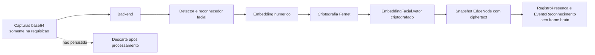

# Diagramas Mermaid Para O TCC

Diagramas consolidados para Metodologia, Desenvolvimento do Prototipo e Analise
dos Resultados. Eles usam nomes de componentes e endpoints do codigo atual.

## 1. Casos De Uso

## 2. Modelo De Dados Simplificado

## 3. Fluxo De Cadastro Biometrico

## 4. Fluxo De Sincronizacao Servidor Para EdgeNode

## 5. Fluxo De Envio De Presenca EdgeNode Para Servidor

## 6. Arquitetura Backend, Frontend, PostgreSQL, Redis E InterSCity

## 7. Mapa Publico E Telemetria InterSCity

## 8. Pontos De Coleta De Metricas

## 9. Estado Derivado Da Aula

## 10. Privacidade Do Fluxo Facial

